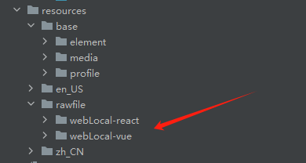

# 鸿蒙开发常见问题

## ArkWeb开发
### 加载在线网页
`注意：访问在线网页时需添加网络权限：ohos.permission.INTERNET` [声明权限文档地址](https://developer.huawei.com/consumer/cn/doc/harmonyos-guides-V5/declare-permissions-V5)
1. Webview里面加载的H5链接，window对象中没有localStorage对象，导致报错、白屏  
需要在web组件后添加.domStorageAccess(true)
```js
 Web({
        src:this.url,
        controller:this.controller
      }).domStorageAccess(true) // 设置是否开启文档对象模型存储接口（DOM Storage API）权限，默认未开启。
```
2. H5页面如果有多个页面，返回的话直接回到了鸿蒙的首页，没有按照h5的返回逻辑  
重写onBackPress逻辑
```js
onBackPress() {
    // 当前页面是否可前进或者后退给定的step步(-1),正数代表前进，负数代表后退
    if (this.controller.accessStep(-1)) {
      this.controller.backward(); // 返回上一个web页
      // 执行用户自定义返回逻辑
      return true;
    } else {
      // 执行系统默认返回逻辑，返回上一个page页
      return false;
    }
  }
build(){
    ...
}
```
### 加载本地网页
`需将资源文件放在resources/rawfile文件下`
1. 本地网页出现跨域问题，导致白屏
```
 "Access to script at 'resource://rawfile/assets/vendor-a77b8109.js' from origin 'null' has been blocked by CORS policy..."
 原因：因为现代前端项目的资源请求基本不可以通过 file://协议直接打开或运行
```
解决办法：结合下面两个方法  
方法1：[解决Web组件本地资源跨域问题](https://developer.huawei.com/consumer/cn/doc/harmonyos-guides-V5/web-cross-origin-V5)  
方法2：[鸿蒙Web组件如何本地部署前端工程](https://developer.huawei.com/consumer/cn/forum/topic/0208150640255630044)  
- 复制脚本代码，保存为webResourceGenerator.js，放到H5工程根目录下 （[脚本代码地址](https://github.com/zhanglong1009/my-tools/blob/main/Harmony/webResourceGenerator.js)）
```js
// 如果你的package.json 中设置了 "type"："module"，使用import导入
// const fs = require('fs');
// const path = require('path');
import fs from 'fs';
import path from 'path';
// 如果你的项目打包目标文件是build，这里改成build
const FileName = "build"
```
- package.json文件下，build命令后加上node脚本，当项目构建完后执行

执行完成后，会在`dist`文件下生成一个`webResource.ts`文件
- 随后将整个dist目录下的文件，放在鸿蒙工程目录`entry\src\main\resources\rawfile`下
- 最后在使用Web组件的地方，引入webResource.ts文件中的函数
```js
import { getSchemeMap,getMimeType } from '../../../resources/rawfile/webLocal-vue/webResource'
  // 构造域名和本地文件的映射表
    schemeMap = getSchemeMap('https://www.chinasoft.com') // getSchemeMap函数需要传递一个url，用来映射
  // 构造本地文件和构造返回的格式mimeType
    mimeTypeMap = getMimeType()

```
完整代码
```js
import { webview } from '@kit.ArkWeb'
import { BusinessError } from '@kit.BasicServicesKit'
import { getSchemeMap,getMimeType } from '../../../resources/rawfile/webLocal-vue/webResource'
@Entry
@Component
struct WebLocalComponents {
  controller: webview.WebviewController = new webview.WebviewController()
  // 构造域名和本地文件的映射表
  schemeMap = getSchemeMap('https://www.chinasoft.com')
  // 构造本地文件和构造返回的格式mimeType
  mimeTypeMap = getMimeType()

  async aboutToAppear() {
    console.log('在创建自定义组件的新实例后，在执行其build函数前执行')
  }

  onBackPress() {
    // 当前页面是否可前进或者后退给定的step步(-1),正数代表前进，负数代表后退
    if (this.controller.accessStep(-1)) {
      this.controller.backward(); // 返回上一个web页
      // 执行用户自定义返回逻辑
      return true;
    } else {
      // 执行系统默认返回逻辑，返回上一个page页
      return false;
    }
  }

  build() {
    Column() {
      Web({
        src: "https://www.chinasoft.com/index.html",
        controller: this.controller
      })
        .javaScriptAccess(true)
        .fileAccess(true)
        .domStorageAccess(true)
        .geolocationAccess(true)
        .width("100%")
        .height("100%")
        .onInterceptRequest((event) => {
          if (!event) {
            return;
          }
          console.info('event', JSON.stringify(event))
          console.log('event.request.getRequestUrl()', event.request.getRequestUrl())
          // 此处匹配自己想要加载的本地离线资源，进行资源拦截替换，绕过跨域
          if (this.schemeMap.has(event.request.getRequestUrl())) {
            let rawfileName: string = this.schemeMap.get(event.request.getRequestUrl())!;
            console.log('rawfileName', rawfileName)
            let mimeType = this.mimeTypeMap.get(rawfileName);
            if (typeof mimeType === 'string') {
              let response = new WebResourceResponse();
              // 构造响应数据，如果本地文件在rawfile下，可以通过如下方式设置
              response.setResponseData($rawfile(rawfileName));
              response.setResponseEncoding('utf-8');
              response.setResponseMimeType(mimeType);
              response.setResponseCode(200);
              response.setReasonMessage('OK');
              response.setResponseIsReady(true);
              console.info('response', response)
              return response;
            }
          }
          return null;
        })
    }
    .width('100%')
    .height('100%')
  }
}
```
`注意：`如果有多个webview组件资源，需要将以下代码加一个前缀  

```js
...
// 构造响应数据，如果本地文件在rawfile下，可以通过如下方式设置
    response.setResponseData($rawfile('webLocal-vue/' + rawfileName));
    response.setResponseEncoding('utf-8');
    response.setResponseMimeType(mimeType);
...
```


