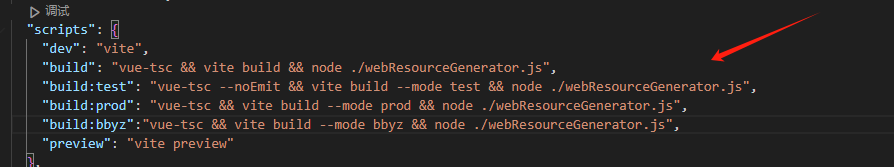

# 鸿蒙开发常见问题
## ArkUI开发
#### 组件导航(Navigation)
1. 组件导航开发步骤
   - 主页面使用Navigation包裹，并定义相关的装饰器，缺一不可
     ```js 
     // 导入所有组件
      import { DyCardDraw } from './demo/1_dy'
      import { WebLinkComponents } from './demo/2_webLink'
      import { WebLocalAngular } from './demo/3_webLocal_angular'
      import { WebLocalVue } from './demo/3_webLocal_vue'
      import { WebLocalReact } from './demo/3_webLocal_react'
     @Provide navPathStack: NavPathStack = new NavPathStack();
     @Builder
      PageMap(name: string) {
        // 条件分支使用else if，不要全用if，有可能会报错
        if (name === "DyCardDraw") {
          DyCardDraw()
        }else if (name === "WebLinkComponents") {
          WebLinkComponents()
        }else if(name === "WebLocalAngular"){
          WebLocalAngular()
        }else if(name === "WebLocalVue"){
          WebLocalVue()
        }else if(name === "WebLocalReact"){
          WebLocalReact()
        }
      }
     build(){
      Navigation(this.navPathStack){
        ...
        // 进行相关的路由操作
         this.navPathStack.pushPath({name:'DyCardDraw'})
      }
      .mode(NavigationMode.Stack)  //设置显示模式 Auto | Stack | Split
      .navDestination(this.PageMap) // 创建NavDestination组件，根据name匹配对应的组件
     }
      ```
    - 子页面需要使用NavDestination包裹
    ```js
    @Component
    export struct DyCardDraw {
      @Consume('NavPathStack') pageStack: NavPathStack;

      build(){
        NavDestination(){
          ...
          // 进行相关的路由操作
           this.pageStack.pop()
        }
      }
    }
    ```
  

## ArkWeb开发
#### 加载在线网页
`注意：访问在线网页时需添加网络权限：ohos.permission.INTERNET` [声明权限文档地址](https://developer.huawei.com/consumer/cn/doc/harmonyos-guides-V5/declare-permissions-V5)
1. Webview里面加载的H5链接，window对象中没有localStorage对象，导致报错、白屏  
需要在web组件后添加.domStorageAccess(true)
```js
 Web({
        src:this.url,
        controller:this.controller
      }).domStorageAccess(true) // 设置是否开启文档对象模型存储接口（DOM Storage API）权限，默认未开启。
```
2. H5页面如果有多个页面，返回的话直接回到了鸿蒙的首页，没有按照h5的返回逻辑  
重写onBackPress逻辑
```js
onBackPress() {
    // 当前页面是否可前进或者后退给定的step步(-1),正数代表前进，负数代表后退
    if (this.controller.accessStep(-1)) {
      this.controller.backward(); // 返回上一个web页
      // 执行用户自定义返回逻辑
      return true;
    } else {
      // 执行系统默认返回逻辑，返回上一个page页
      return false;
    }
  }
build(){
    ...
}
```
#### 加载本地网页
`需将资源文件放在resources/rawfile文件下`
1. 本地网页出现跨域问题，导致白屏
```
 "Access to script at 'resource://rawfile/assets/vendor-a77b8109.js' from origin 'null' has been blocked by CORS policy..."
 原因：因为现代前端项目的资源请求基本不可以通过 file://协议直接打开或运行
```
解决办法：结合下面两个方法  
方法1：[解决Web组件本地资源跨域问题](https://developer.huawei.com/consumer/cn/doc/harmonyos-guides-V5/web-cross-origin-V5)  
方法2：[鸿蒙Web组件如何本地部署前端工程](https://developer.huawei.com/consumer/cn/forum/topic/0208150640255630044)  
- 复制脚本代码，保存为webResourceGenerator.js，放到H5工程根目录下 （[脚本代码地址](https://github.com/zhanglong1009/my-tools/blob/main/Harmony/webResourceGenerator.js)）
```js
// 如果你的package.json 中设置了 "type"："module"，使用import导入
// const fs = require('fs');
// const path = require('path');
import fs from 'fs';
import path from 'path';
// 如果你的项目打包目标文件是build，这里改成build
const FileName = "build"
```
- package.json文件下，build命令后加上node脚本，当项目构建完后执行

执行完成后，会在`dist`文件下生成一个`webResource.ts`文件
- 随后将整个dist目录下的文件，放在鸿蒙工程目录`entry\src\main\resources\rawfile`下
- 为了后续使用方便，将代码封装为WebLocal.ets组件，放在`entry\src\main\ets\components`下
```js
import { uiObserver, UIObserver } from '@kit.ArkUI';
import { webview } from '@kit.ArkWeb'

interface webResourceItem {
  path: string
  mimeType: string
}

@Component
export struct WebLocal {
  controller: webview.WebviewController | null = null
  // 资源映射
  @State schemeMap: Map<string, string> = new Map()
  @State mimeTypeMap: Map<string, string> = new Map()
  webResourceList: webResourceItem[] = []
  // 临时构造的请求地址
  requestUrl: string = "https://www.chinasoft.com"
  // 本地资源路径，如果rawfile下有多个资源文件夹，可以传入该属性
  rawFilePath: string = ""

  aboutToAppear(): void {
    console.log('webResourceList',JSON.stringify(this.webResourceList))
    this.getSchemeMap()
    this.getMimeType()
  }

   getSchemeMap() {
    this.webResourceList.forEach(item => {
      const key:string = this.requestUrl + '/' + item.path
      this.schemeMap.set(key,item.path)
    })
  }

  getMimeType() {
    this.webResourceList.forEach(item => {
      this.mimeTypeMap.set(item.path,item.mimeType)
    })
  }


  build() {
    Column() {
      Web({
        src: this.requestUrl + "/index.html",
        controller: this.controller
      })
        .javaScriptAccess(true)
        .fileAccess(true)
        .domStorageAccess(true)
        .geolocationAccess(true)
        .width("100%")
        .height("100%")
        .onInterceptRequest((event) => {
          if (!event) {
            return;
          }
          console.log('event.request.getRequestUrl()', event.request.getRequestUrl())
          // 此处匹配自己想要加载的本地离线资源，进行资源拦截替换，绕过跨域
          if (this.schemeMap.has(event.request.getRequestUrl())) {
            let rawfileName: string = this.schemeMap.get(event.request.getRequestUrl())!;
            console.log('rawfileName', rawfileName)
            let mimeType = this.mimeTypeMap.get(rawfileName);
            if (typeof mimeType === 'string') {
              let response = new WebResourceResponse();
              // 构造响应数据，如果本地文件在rawfile下，可以通过如下方式设置
              response.setResponseData($rawfile(this.rawFilePath + rawfileName));
              response.setResponseEncoding('utf-8');
              response.setResponseMimeType(mimeType);
              response.setResponseCode(200);
              response.setReasonMessage('OK');
              response.setResponseIsReady(true);
              return response;
            }
          }
          return null;
        })
    }
  }
}
```
- 使用了web组件的地方，调用该组件，并传入对应的参数
```js
import { webResourceList } from 'resources/rawfile/webLocal-vue/webResource'
import { WebLocal } from '../../components/WebLoca'
import { webview } from '@kit.ArkWeb'
@Entry
@Component
struct WebLocalComponents {
  controller: webview.WebviewController = new webview.WebviewController()
  // 自定义组件不支持该生命周期
  onBackPress() {
    // 当前页面是否可前进或者后退给定的step步(-1),正数代表前进，负数代表后退
    if (this.controller.accessStep(-1)) {
      this.controller.backward(); // 返回上一个web页
      // 执行用户自定义返回逻辑
      return true;
    } else {
      // 执行系统默认返回逻辑，返回上一个page页
      return false;
    }
  }
  build() {
    Column() {
      // 使用组件
      WebLocal({
        webResourceList:webResourceList,
        rawFilePath:'webLocal-vue/', // 如果rawfile的webLocal-vue下面有index.html资源文件
        controller:this.controller
      })
    }
    .width('100%')
    .height('100%')

  }
}
```


